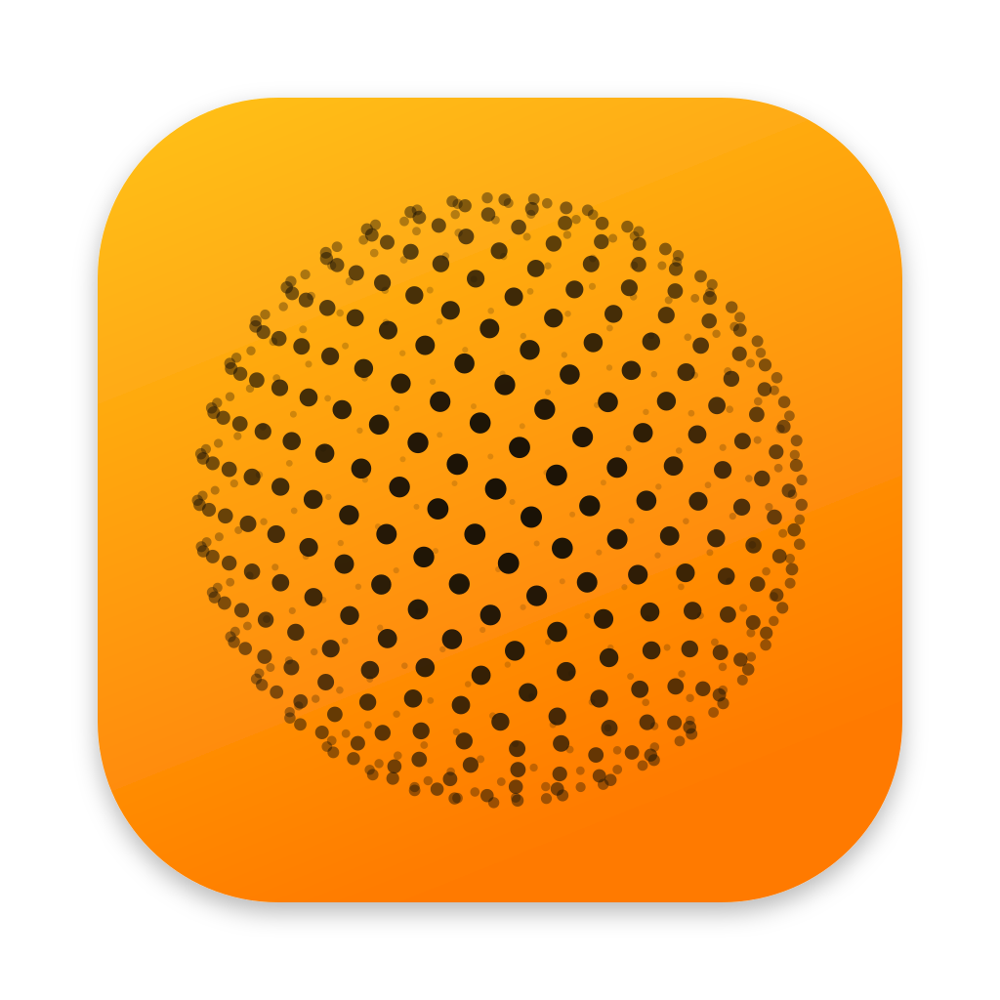

# Spatialize

Apple's Spatial Audio (Fixed mode) for Spotify, and any other app, on macOS.

macOS only spatializes audio played through Apple's own media frameworks, so apps like Spotify
never get Spatialize Stereo. Spatialize measures what Apple's spatializer does on your Mac and
applies exactly that processing to the apps you choose, in real time.

## Requirements

- macOS 14.2 or later
- AirPods or Beats that support Spatial Audio

## Install

1. Download `Spatialize-vX.Y.Z.zip` from
   [Releases](https://github.com/yousofss/spotify-spatializer/releases/latest) and unzip it.
2. Move `Spatialize.app` to Applications and open it.
3. macOS blocks the first launch because the app isn't notarized. Open System Settings →
   Privacy & Security, click Open Anyway, and allow audio capture when asked.

## First launch: measure your AirPods

Spatialize needs a one-time measurement of about a minute. It captures your Personalized Spatial
Audio profile and the loudness at your current volume, so it has to happen on your Mac with your
AirPods.

1. Put your AirPods on.
2. When the dialog appears, open Control Center → Sound, set Spatialize Stereo to Fixed for
   Spatialize, and click Measure.
3. Wait for the chime. The measurement is silent and takes about 40 seconds.

Measure again from the menu after changing your Personalized Spatial Audio profile, after major
macOS updates, or to match a different listening volume.

## Use

The AirPods icon in the menu bar shows what's being spatialized. Spatialize follows output device
changes and attaches to the target apps whenever they play. The menu has:

- **Pause / Resume**
- **Target Apps**: which apps to spatialize (Spotify by default). Skip apps that already get
  Apple's spatialization, like Apple Music or video in Safari and QuickTime, or they're
  processed twice.
- **Use Built-in Mic** (on by default): keeps the Mac's microphone as the input, because using
  the AirPods mic drops them into low-quality call mode. Turn it off to take calls on the AirPods.
- **Measure Spatial Audio…**

## How it works

1. Spatialize plays sine sweeps in a short movie through AVPlayer, where macOS applies its real
   spatializer, and records the result with a Core Audio process tap.
2. The sweeps are deconvolved into the four impulse responses of the render (L→L, L→R, R→L,
   R→R). They contain everything: the binaural room response, Apple's private tuning stages, and
   your personal profile.
3. The menu bar app taps the target apps, mutes their direct output, convolves the audio with
   those responses (partitioned FFT, ~11 ms latency), and plays the result.

Because it's Apple's own processing, the result matches Apple's Fixed mode.

## Build from source

```
./build.sh
```

Produces a universal `build/Spatialize.app`. Pushing a version tag
(`git tag v1.1.0 && git push origin v1.1.0`) makes GitHub Actions build it and publish a release.

- `Sources/`: menu bar app, convolution engine, and measurement
- `Tests/`: round-trip check for the IR extraction
- `.github/workflows/build.yml`: builds every push, publishes a release for each `v*` tag

---

This project is fully vibecoded. It works great on my machine, but if something breaks on
yours or you see room for improvement, PRs are very welcome.
